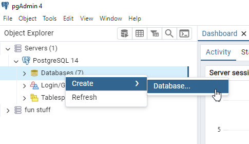
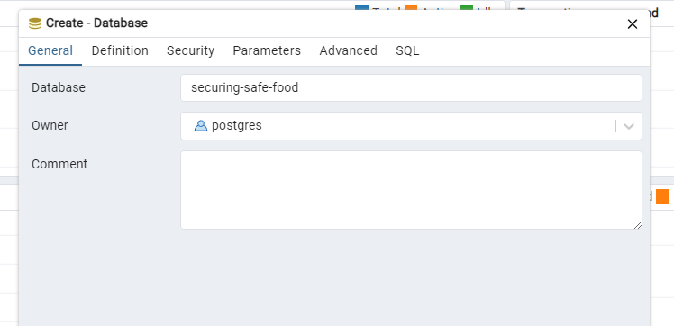

## Backend Setup

This part can be a little tricky! If you run into some confusing errors along the way, don't be afraid to reach out if have any trouble!

You'll need to download:

1. [PostgreSQL](https://www.postgresql.org/download/)
2. [PgAdmin 4](https://www.pgadmin.org/download/) (if PostgreSQL didn't come with it)

Then, set up a database called `securing-safe-food`. If you're not familiar with how to do so, it's easy to do through PgAdmin

1. Open PgAdmin and configure your credentials (if necessary). Then, right click on the `Databases` dropdown (under `Servers` > `PostgreSQL [version]`)
   


2. Enter "securing-safe-food" as the database name
   


Next, create a file called `.env` in the **root directory** (under `ssf/`) and copy over the contents from `.env.example`. Replace `DATABASE_PASSWORD` with the password you entered for the `postgres` user (NOT necessarily your PgAdmin master password!)

You can check that your database connection details are correct by running `nx serve backend` - if you can see the following line in the terminal, then you've got it right!

```
"LOG 🚀 Application is running on: http://localhost:3000/api"
```

Finally, run `yarn run typeorm:migrate` to load all the tables into your database. If everything is set up correctly, you should see "Migration ... has been  executed successfully." in the terminal.

# AWS Setup

We have a few environment variables that we utilize to access several AWS services throughout the application. Below is a list of each of them and how to access each after logging in to AWS

1. `AWS_ACCESS_KEY_ID` and `AWS_SECRET_ACCESS_KEY`:
   - Click on your username in the top right corner, and navigate to Security Credentials
   - Scroll down to access keys, and create a new key
   - Select CLI as the purpose for the key, and add an optional description
   - Replace both the public and secret keys in the .env file to those values. Note that the secret key will not be accessible after you leave this page
   - Click done

2. `AWS_REGION`:
This can be found next to your profile name when you login to the main page. Some accounts may be different, but we generally use us-east-1 or us-east-2

3. `AWS_BUCKET_NAME`:
This one is already given to you. As of right now, we only use one bucket, confirm-delivery-photos to store photos in a public S3 Bucket. This may be subject to change as we use S3 more in the project.
